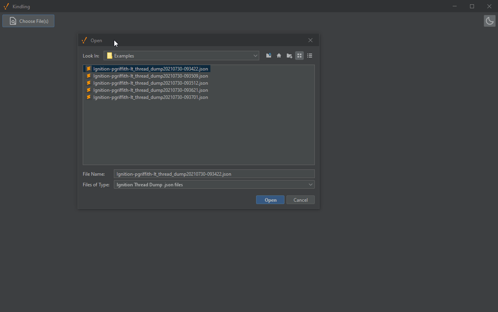

# Kindling

A standalone collection of utilities to help [Ignition](https://inductiveautomation.com/) users. Features various tools
to help work with Ignition's custom data export formats.

## Thread Viewer

Parses Ignition thread dump .json files (generated by all Ignition mechanisms since 8.1.10).

## Log Viewer

Parses Ignition's `system_logs.idb` file to display a structured view of logs, and their attached **M**apped
**D**iagnostic **C**ontext (MDC) keys.

## Store and Forward Cache Viewer

Opens the [HSQLDB](http://hsqldb.org/) file that contains the Store and Forward disk cache. Attempts to parse the
Java-serialized data within into its object representation. If unable to deserialize (e.g. due to a missing class),
falls back to a string explanation of the serialized data.

## Usage

Download either the installer or portable executable from the releases tab. Once running, you can use Kindling to open
various Ignition related files. You can use the 'Choose Files' button in the tab bar to open specific files, or drag and
drop files from your OS onto the running window. In addition, Kindling will interpret each command-line argument it
receives on startup as a filepath to open, allowing it to be registered as a file handler at the OS level.

## Development

Kindling uses Java Swing as a GUI framework, but is written almost exclusively in Kotlin, an alternate JVM language. Gradle
is used as the build tool, and will automatically download the appropriate Gradle and Java version (via the Gradle
wrapper). Most IDEs (Eclipse, IntelliJ) should figure out the project structure automatically. You can directly run the
main class in your IDE ([MainPanel](src/main/kotlin/io/github/paulgriffith/MainPanel.kt)), or you can run the
application via`./gradlew run` at the command line.

## Contribution

Contributions of any kind (additional tools, polish to existing tools) are welcome.

## Releases

`./gradlew jpackage` will generate a `jpackage` folder in `build/`. The outer level `support-tools-$version.exe` can be
used as an installer, or you can zip the `support-tools` folder and distribute it directly as a portable executable.

## Acknowledgements

- [BoxIcons](https://github.com/atisawd/boxicons)
- [FlatLaf](https://github.com/JFormDesigner/FlatLaf)
- [SerializationDumper](https://github.com/NickstaDB/SerializationDumper)

## Disclaimer

This is **not** an official Inductive Automation product and is not affiliated with, supported by, maintained by, or
otherwise associated with Inductive Automation in any way. This software is provided with no warranty.
